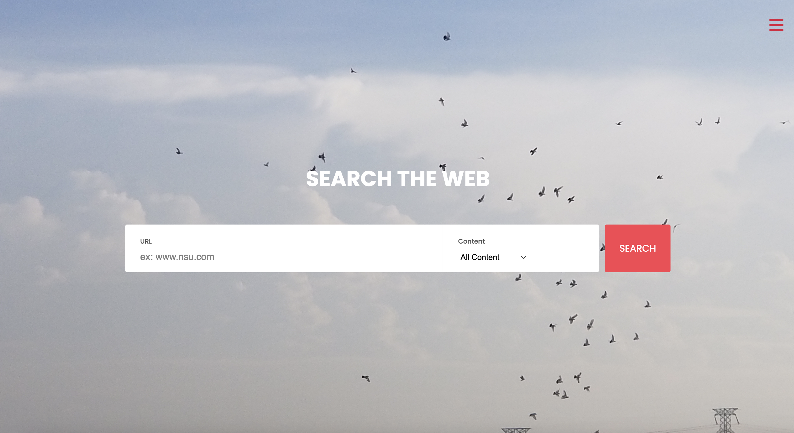

# CrazyCrawler

Welcome to the repository!

  

## Project Description

"CrazyCrawler" is a new, self-contained product designed with the aim of making web searching easier, more efficient, and organized. As of the current release, it is a self-sustaining product without any subsystem or integrable part. The product is for any individual or group looking to search data from the web precisely and effectively. Using it will enable users to make clusters of URLs and search for specific content in their cluster. Users can download, store, and use the contents easily and efficiently. Especially for regular users, fast scraping of data using web crawlers is of great importance. With the aim of making it easier for them, the product is developed.

  

  

## Product Functions

  

The following functionalities are included in the product:

  

**Search Content:** Users can select the file and content type and provide URLs. The search engine will find all files matching the file type and/ or content type and display the results with details.

  

**Make Clusters from Search Results:** Users can form search clusters by grouping website URLs. The user can save these clusters and download the files in batches.

  

**View Saved Clusters:** Saved clusters can be viewed by the user from a dashboard. It can be arranged according to file/ content type. The clusters can also be sorted alphabetically or according to date.

  

**Search Within Clusters:** Users can search for a specific content or file type in a specific cluster. The files may be PDF, text, doc, or non-HTML files. Content types include video, audio, photos, etc.

  

**Indexing Clusters:** The contents of a cluster are self-indexed using elastic search to ensure fast retrieval.

  

**Download / Save content:** Users can download the searched file into their device directly from the search results.

  

**Sign Up:** Users can sign up using an email or Google/ Facebook account.

  

**Login:** Login is password protected.

  

**Recover Password:** User can recover their lost/forgotten password. This option will be available on the login page.

  

**Create User Profile:** Users will be create and view personal profiles.

  

**Edit Profile:** User can edit their account, i.e., change their profile photo, edit their username, reset their password, and edit other information on the profile.

  

## Built Using

1. Django

2. Kotlin

3. HTML

4. JavaScript

5. CSS / SCSS

6. Elastic Search

6. Google OAuth

  

**Note**

>The application is compatible with both desktops (web-based) and Android devices.

  
*** Contributions can be viewed in: https://github.com/alifelham/File-Search-Engine-App

## Contact Details:
Mohammad Junayed Hasan: junayedhasan100@gmail.com
